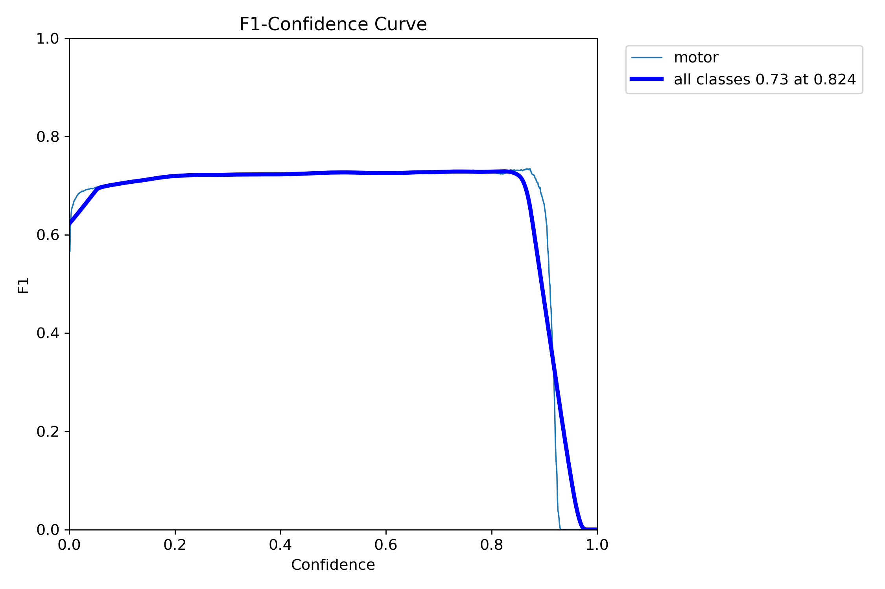

# YOLOv8 Training Results

---

## 1. Normalized Confusion Matrix

- **True Positives (motor → motor):** 0.91  
- **False Negatives (motor → background):** 0.09  
- **True Negatives (background → background):** 1.00  
- **False Positives (background → motor):** 0.00  

> The model rarely confuses background as motor, but misses about 9 % of actual motors.

---

## 2. Training & Validation Losses & Metrics

| Curve             | Description                                                      |
|-------------------|------------------------------------------------------------------|
| **train/box_loss**    | Rapid decline from ~5.3 → 0.6 over 100 epochs                     |
| **train/cls_loss**    | From ~26 → 0.4, converging by ~epoch 20                          |
| **train/dfl_loss**    | From ~2.1 → 0.8, leveling out after ~epoch 10                    |
| **val/box_loss**      | Fluctuates 4.1 → 2.4, then slowly down to ~2.45                    |
| **val/cls_loss**      | Drops 3.4 → ~1.1, slight up-and-down but stable around ~1.15       |
| **val/dfl_loss**      | From 1.35 → ~0.93, converges after ~epoch 20                      |
| **Precision (val)**   | Climbs quickly to ~0.88 by epoch 30, then plateaus               |
| **Recall (val)**      | Rises to ~0.86 by epoch 30, then smooths out around ~0.85         |
| **mAP@0.5 (val)**     | Increases to ~0.89 by epoch 30, peaks near ~0.90                  |
| **mAP@0.5–0.95 (val)**| Gradual climb to ~0.36 by epoch 100                             |

> Loss curves show fast convergence in first 20 epochs. Validation metrics stabilize by epoch 30, with no major over-fitting.

---

## 3. Confidence ↔ Recall / Precision / F1 Analysis

### 3.1 Recall-Confidence Curve

- **Recall @ confidence=0.00:** ~0.95  
- Recall steadily decreases as threshold increases; at **thr≈0.80**, recall ≈0.82.

### 3.2 Precision-Confidence Curve

- **Precision @ confidence=0.98:** ~1.00  
- Precision rises from ~0.47 @thr=0.00 to ~1.00 @thr≈0.98.

### 3.3 Precision-Recall Curve

- **mAP@0.5:** ~0.80 (area under this curve)  
- High precision (≈0.90+) maintained down to recall ≈0.70.

### 3.4 F1-Confidence Curve

- **Max F1 ≈0.73** at **confidence ≈0.82**  

---

## 4. Summary of Key Metrics

| Metric                    | Value       |
|---------------------------|-------------|
| mAP@0.5                   | ~0.90       |
| mAP@0.5–0.95              | ~0.36       |
| Precision (val)           | ~0.88       |
| Recall (val)              | ~0.86       |
| Best F1 score             | 0.73        |
| Optimal confidence thresh.| 0.82        |

- **Inference threshold:** set `conf=0.82` to maximize balanced precision & recall (F1=0.73).  
---